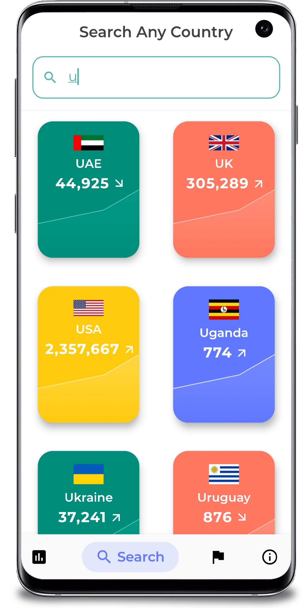
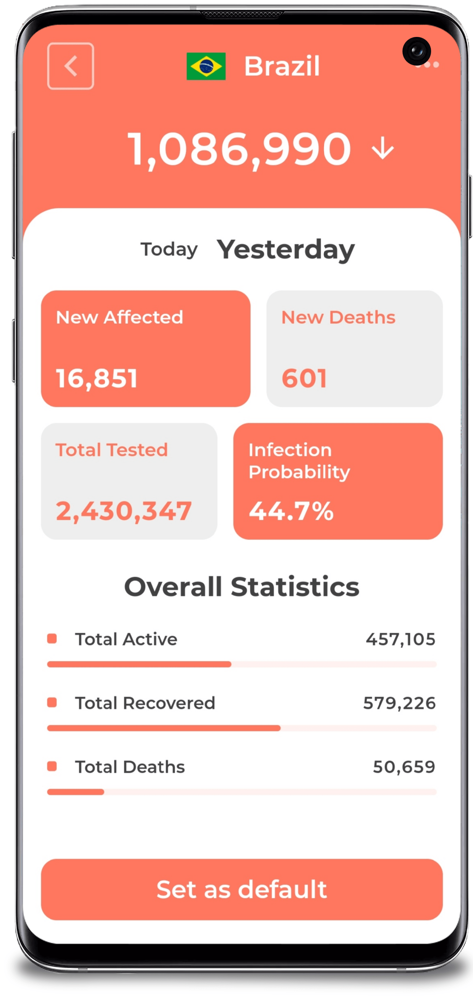
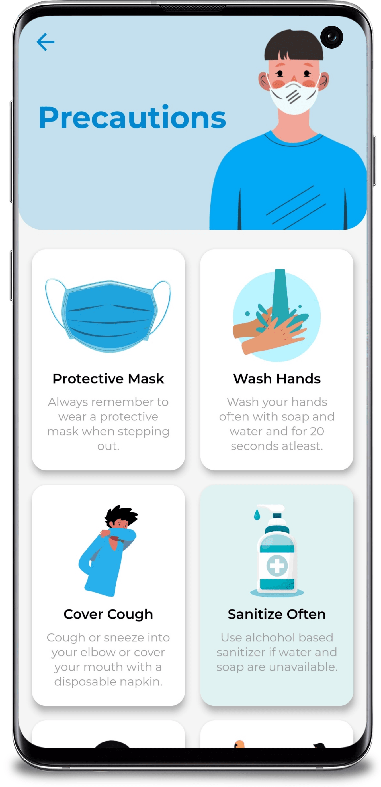

# corona-virus-live-traking-app
This application Tracks Corona Gobal Confirmed Casses of Corona Virus Live,

Covid Tracker is an app made with **Flutter** framework to provide worldwide information related to Covid-19 pandemic. 
The api used for the data can be found [here](https://corona.lmao.ninja/docs/).
Features

  - Global case count.
  - Case, death and recovery count of each country
  - Total tests and infection probability of each country
  - News updates related to vaccine developement
  - Info, symptoms, precautions and myths of the virus
  - Setting a default country

The UI is inspired by [Dribbble](https://dribbble.com/shots/10847147-Coronavirus-Covid-19-Dashboard)

<kbd></kbd>

  

&nbsp;&nbsp;&nbsp;  
&nbsp;  
&nbsp;&nbsp;&nbsp;

## ⭐ Future Features

  - Drawer for easier navigation
  - Onboarding screens
  - Login authentication using Firebase
  - Maps API to detect nearby danger spots

## 🚀 Technologies

  - [Flutter v1.17.4](https://storage.googleapis.com/flutter_infra/releases/stable/windows/flutter_windows_1.17.4-stable.zip)
  - [Dart v2.8.4](https://dart.dev/get-dart)
